## Introduction

Having set up my development environment and integrated real-time stock data, I now need to deploy my application to Azure. In this post, I'll guide you through three key steps: containerizing my app with Docker for consistent behavior across environments, pushing the Docker image to Azure Container Registry for secure storage, and deploying via Azure App Service to make it cloud-accessible.

First, I'll containerize my application with Docker. This packages my app with its dependencies to ensure consistent operation anywhere, eliminating "works on my machine" problems. My Docker image will include all necessary components—code, runtime, tools, libraries, and settings.

After creating my Docker image, I'll push it to Azure Container Registry, allowing Azure to pull and run my application in an isolated environment. Docker uses OS-level virtualization to deliver software in containers, and Visual Studio provides simple tools for building, debugging, and deploying containerized applications. I can work with a single container or use orchestration tools for multiple services.

## Docker support in Visual Studio

Docker support is available for [ASP.NET](http://ASP.NET) projects, [ASP.NET](http://ASP.NET) Core projects, and .NET Core and .NET Framework console projects. Visual Studio's Docker support has evolved across several releases to better meet customer needs. You can add two levels of Docker support to your project, with options varying by project type and Visual Studio version. For simpler needs, you can add basic Docker support to containerize a single project without orchestration. The more advanced level is container orchestration support, which adds files specific to your chosen orchestrator. Visual Studio 2022 features the **Containers** window, which allows you to view running containers, browse images, inspect environment variables, logs, port mappings, examine the filesystem, attach a debugger, or open a terminal inside the container environment.

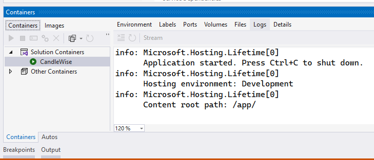

I added Docker support to the existing project by selecting **Add** > **Docker Support** in **Solution Explorer**. The **Add > Docker Support** and **Add > Container Orchestrator Support** commands are located on the right-click menu (or context menu) of the project node for an [ASP.NET](http://ASP.NET) Core project in **Solution Explorer**. I selected Linux as the target OS.

The following changes were made:

- A Dockerfile was added to my project. This file contains the instructions for Docker to build an image of my application.
- A .dockerignore file was added. This file specifies the files and directories that Docker should ignore when building the Docker image.
- A NuGet package reference to the Microsoft.VisualStudio.Azure.Containers.Tools.Targets was added to my project. This package provides additional tools and targets for building Docker images.

The created Dockerfile resembled the following code:

```json
FROM mcr.microsoft.com/dotnet/aspnet:6.0 AS base
WORKDIR /app
EXPOSE 80
EXPOSE 443

FROM mcr.microsoft.com/dotnet/sdk:6.0 AS build
ARG BUILD_CONFIGURATION=Release
WORKDIR /src
COPY ["CandleWise.csproj", "."]
RUN dotnet restore "./././CandleWise.csproj"
COPY . .
WORKDIR "/src/."
RUN dotnet build "./CandleWise.csproj" -c $BUILD_CONFIGURATION -o /app/build

FROM build AS publish
ARG BUILD_CONFIGURATION=Release
RUN dotnet publish "./CandleWise.csproj" -c $BUILD_CONFIGURATION -o /app/publish /p:UseAppHost=false

FROM base AS final
WORKDIR /app
COPY --from=publish /app/publish .
ENTRYPOINT ["dotnet", "CandleWise.dll"]
```

I'll now run my app using Docker. I should see the same result as before, but this time my app will be running in an isolated environment.

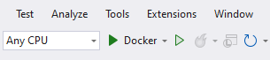

## The Containers Window

I used the **Containers** window to view containers and images on my machine and see what was happening with them. I was able to view the filesystem, volumes mounted, environment variables, ports used, and examine log files. I opened the **Containers** window by using the quick launch (**Ctrl**+**Q**) and typing `containers`. I used the docking controls to position the window appropriately. Because of the width of the window, I found it worked best when docked at the bottom of the screen. I selected a container and used the tabs to view the available information. To explore further, I ran my Docker-enabled app, opened the **Files** tab, and expanded the **app** folder to see my deployed app on the container.

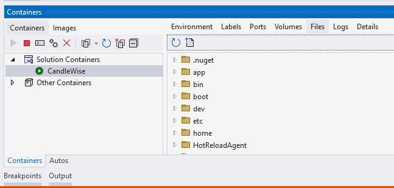

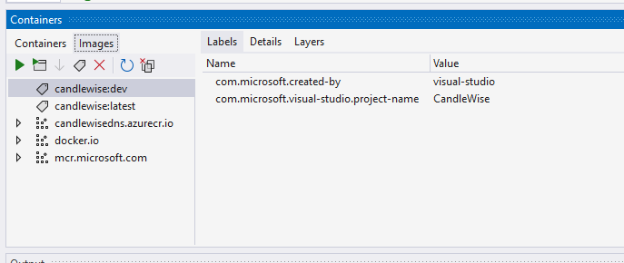

## Deployment Using Azure App Service

Finally, I used Azure App Service to deploy my web application.

Azure App Service is a fully-managed platform for building, deploying, and scaling web applications. It provides automatic management of the servers, which allowed me to focus more on development rather than infrastructure management. In addition to this, Azure App Service offers auto-scaling, high availability, and security patching which ensures my application is robust and can handle varying loads.

I configured the App Service to pull the Docker image from the Azure Container Registry and start a container based on this image. This way, my application, now containerized, can be easily deployed, managed, and scaled.

The AZD template contains files that generated the following required resources for my application to run in App service:

- A new [resource group](https://learn.microsoft.com/en-us/azure/azure-resource-manager/management/overview#terminology) to contain all of the Azure resources for the service.
- A new [App Service plan](https://learn.microsoft.com/en-us/azure/app-service/overview-hosting-plans) that specifies the location, size, and features of the web server farm that hosts my app.
- A new [App Service app](https://learn.microsoft.com/en-us/azure/app-service/overview-hosting-plans) instance to run the deployed application.

I followed these steps to create my App Service resources and publish my project:

1. In **Solution Explorer**, I right-clicked the **MyFirstAzureWebApp** project and selected **Publish**.
2. In **Publish**, I selected **Azure** and then **Next**.
3. I chose **Azure App Service Container** as my **Specific target**. Then, I selected **Next**.

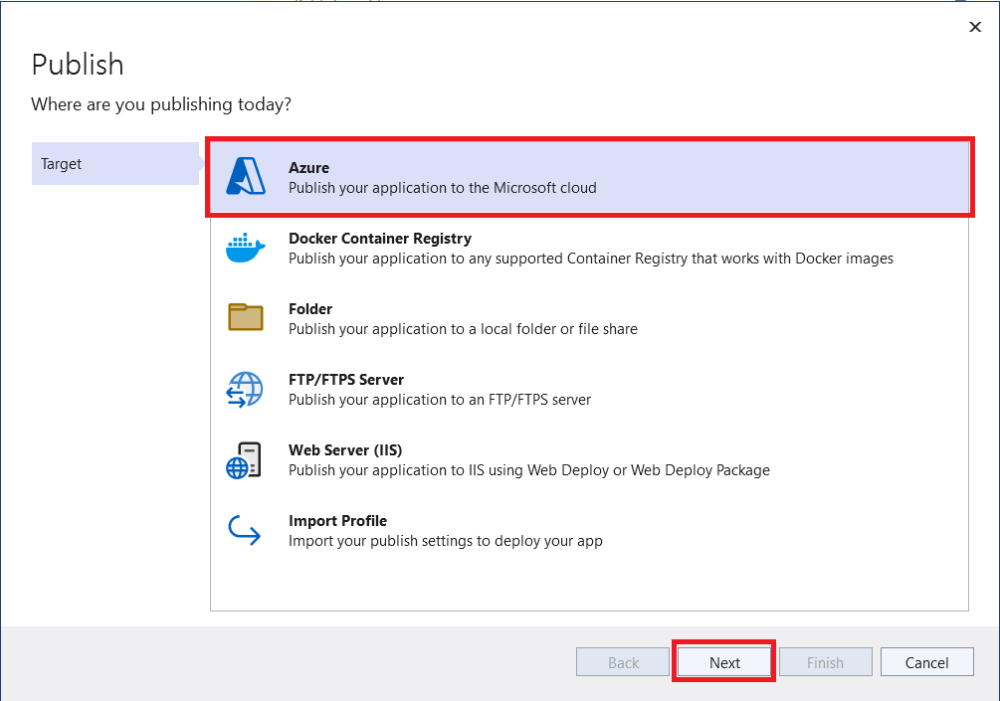


I needed to have a Visual Studio account linked to an Azure account.

I began by creating an App Service for my web application on Azure. Azure App Service is a fully managed platform for building, deploying, and scaling web applications. This service provided automatic management of the servers, making it an ideal solution for me as I wanted to avoid the overhead of setting up, scaling, and maintaining servers to run my application. Moreover, it offered auto-scaling, high availability, and security patching features, making it a robust platform for deploying my web application.

Since I had no resource groups present in my Azure account, I needed to create at least one. A resource group is a container that holds related resources for an Azure solution. It's a way to organize and collectively manage Azure resources, since Azure resources must be allocated to a resource group. I could create a resource group while creating a resource, such as an App Service, or create it beforehand and then assign resources to it.

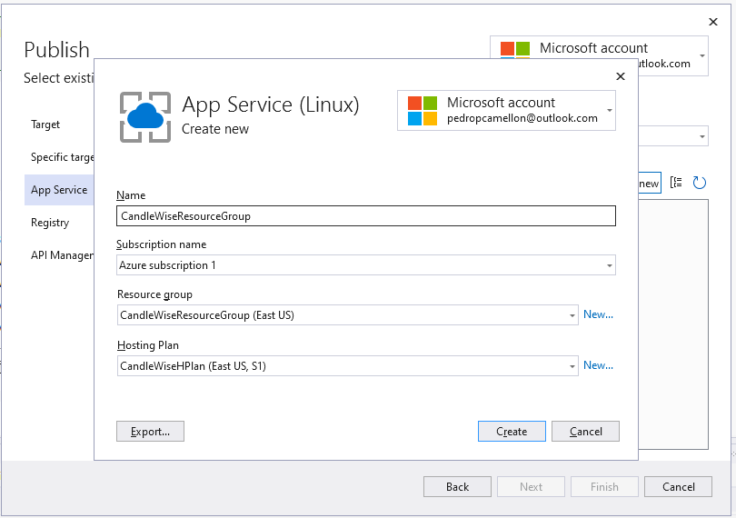

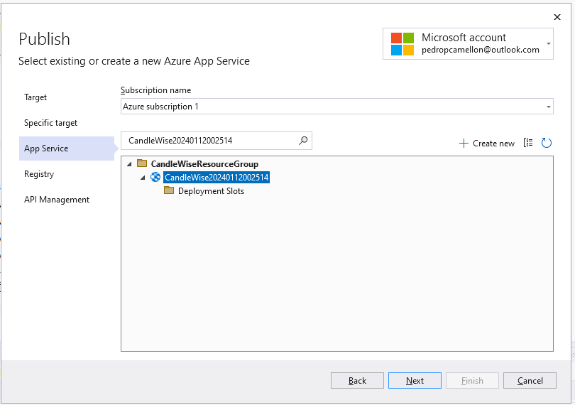

I used Azure Container Registry to publish the Docker image for my application. This managed, private Docker registry service is based on the open-source Docker Registry 2.0. It allowed me to build, store, and manage my container images and artifacts in a secure, private registry. After pushing my Docker image to Azure Container Registry, I could pull and run it on any environment supporting Docker, giving me flexibility in deployment options.

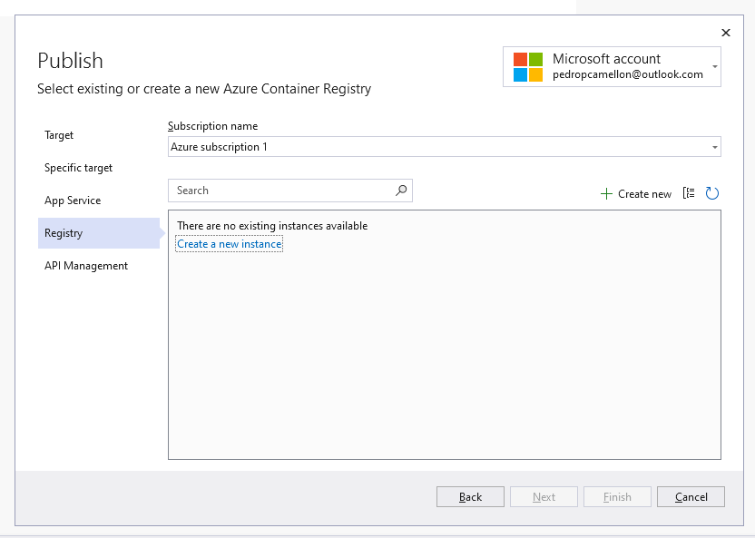

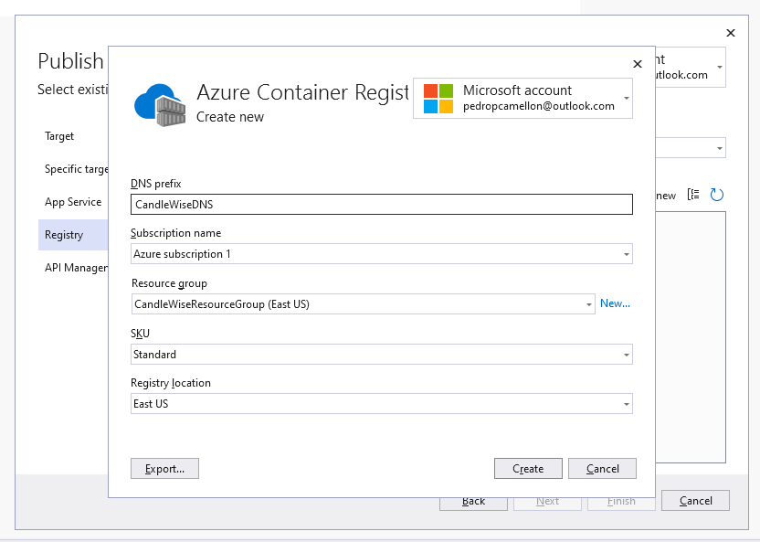

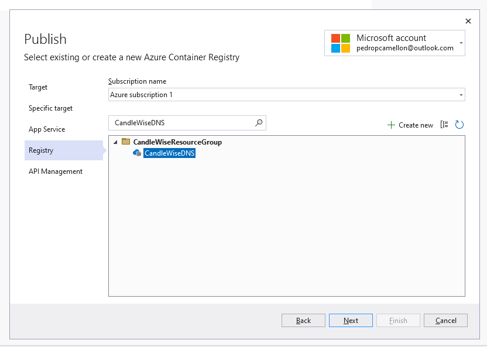

Lastly, I set up the API for my application. This involved configuring the API endpoints to respond to client requests. I also needed to ensure that the API was secure, scalable, and able to handle high volumes of requests. I implemented authentication mechanisms to secure my endpoints, added caching to improve performance, and configured load balancing to distribute traffic evenly across my servers. Once I completed the API setup, it served as the main interface for clients to interact with my application, providing them with access to the data and services they need.

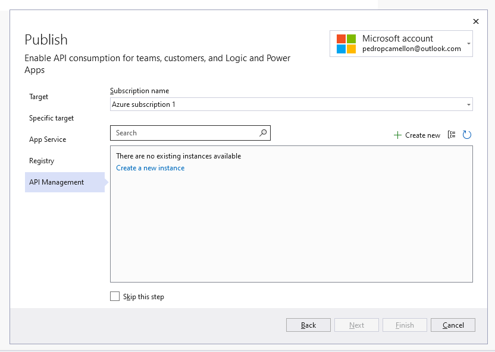

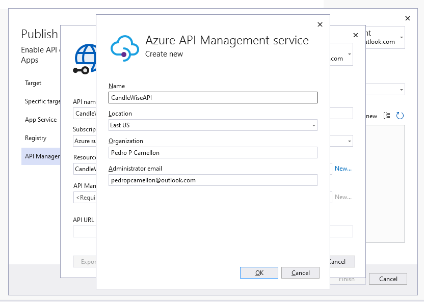

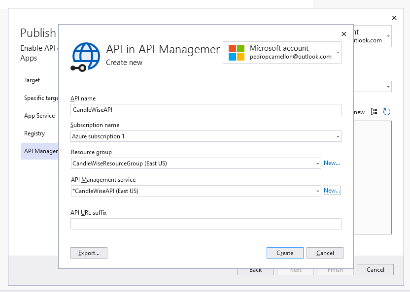

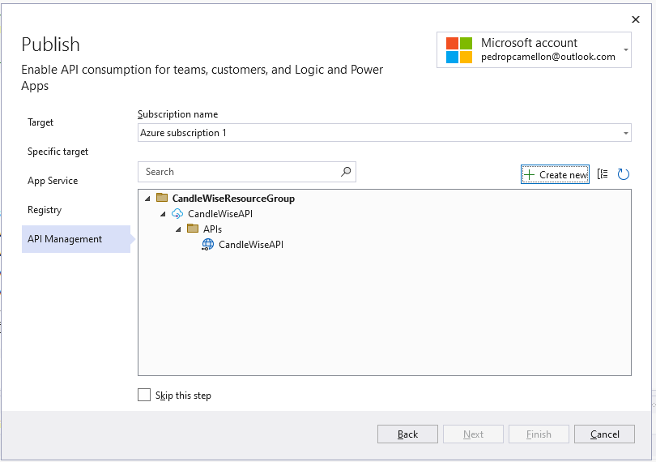

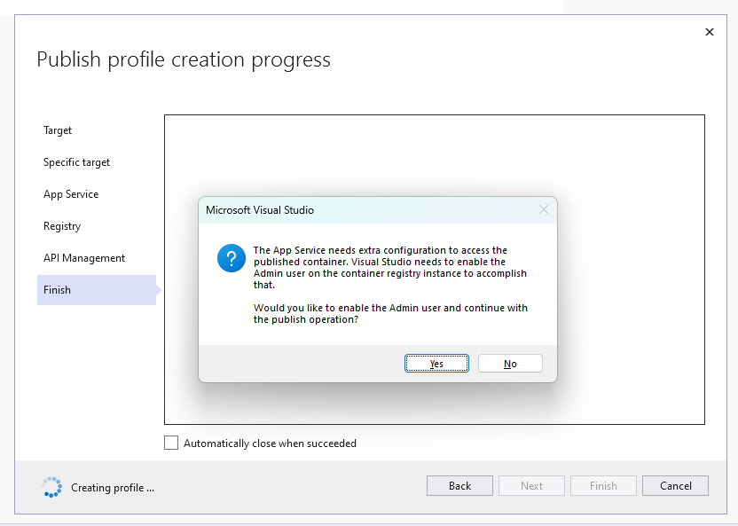

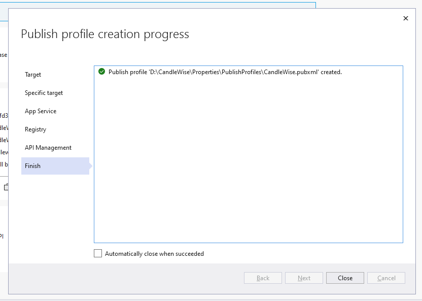

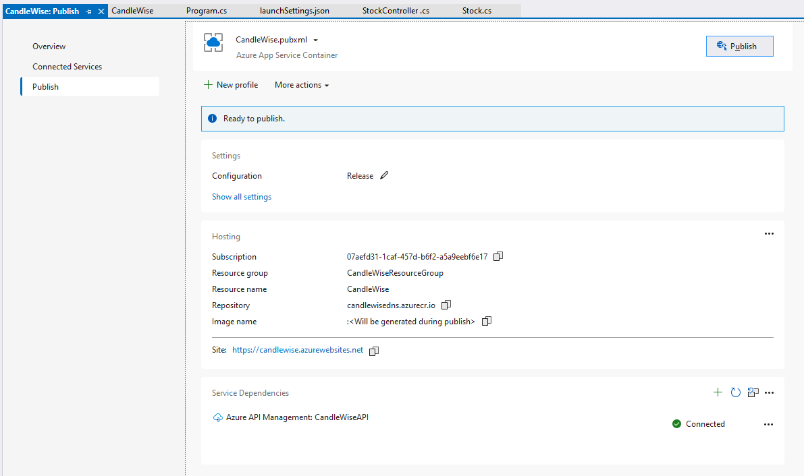

After following the steps outlined above and successfully deploying my application to Azure, I had to wait a few minutes for my app to be up and running. I learned that Azure needs time to initialize the resources, pull the Docker image from the Azure Container Registry, and start the container for my application. During this waiting period, I wasn't able to immediately access my application. However, I knew this was a normal part of the process, and my application would be accessible shortly.

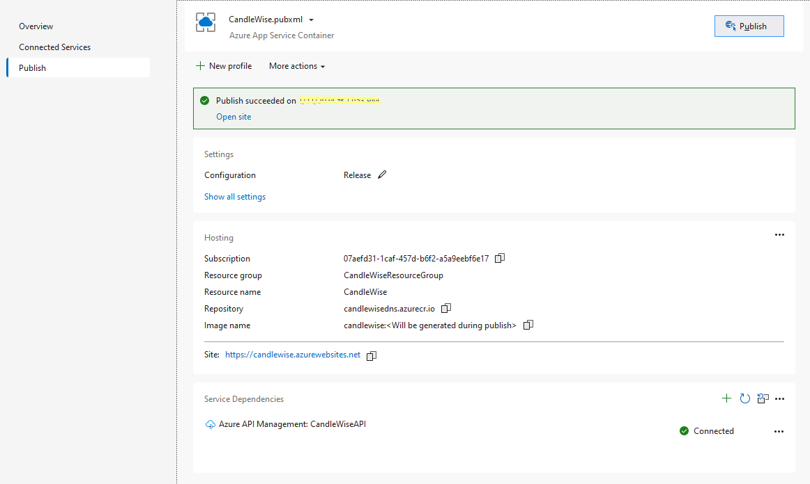

During my deployment process, I encountered an error: "Publish has encountered an error. Docker support must be enabled in the project. See [https://aka.ms/vs-add-docker](https://aka.ms/vs-add-docker) for information on adding Docker support to the project." I had to revisit the steps related to the creation and setup of my Docker image. I carefully verified that each step had been completed successfully, as this error indicated there was an issue with the Docker support within my project.

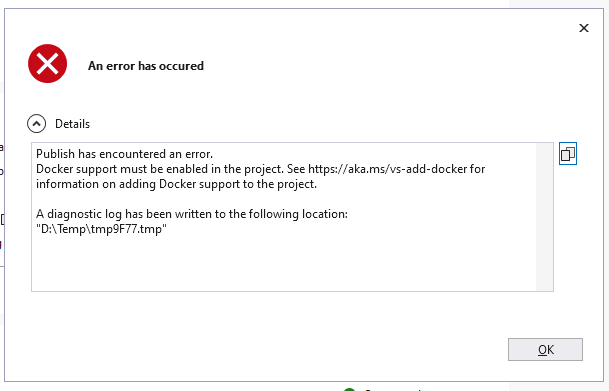

After resolving the issue, I navigated to [candlewise.azurewebsites.net/api/Stock](http://candlewise.azurewebsites.net/api/Stock) in my web browser and saw the same response as when I ran the application locally. This confirmed I had successfully deployed my application to Azure, and it was now accessible through the internet. The response was a JSON object representing the current stock data, identical to what I saw when testing the application on my local machine.

```json
[
  {
    "id": 0,
    "symbol": "AAPL",
    "companyName": "Apple Inc.",
    "price": 0
  },
  {
    "id": 0,
    "symbol": "GOOGL",
    "companyName": "Google",
    "price": 0
  }
]
```

## Conclusions

I containerized my application with Docker for consistent environment execution, pushed the image to Azure Container Registry for secure management, and deployed it to Azure cloud via App Service. This process demonstrated how I effectively deployed my application to a scalable platform using Azure's hosting and management services.
