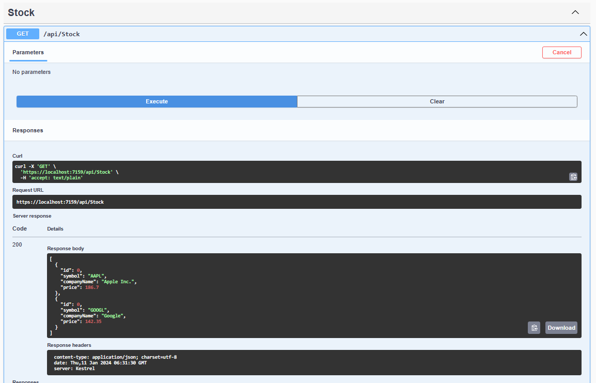

## Introduction

In this article, I continued my series on building **CandleWise - A Portfolio Management App** using ASP.NET Core 6. I focused on integrating real-time stock data with IHttpClientFactory, a tool for managing HttpClient instances. In my previous article, I built the foundation of my portfolio management app using predefined data. While effective for testing, this approach limited me to static data, which didn't reflect the dynamic nature of stock markets. In this second part, I transformed my application from static to dynamic by integrating with a third-party data provider. This allowed me to fetch real-time stock quotes, providing users with current market data.

With real-time data integration, I designed CandleWise to offer users the up-to-date information they needed for making informed investment decisions. In this guide, I walked through the process of integrating stock market data using a third-party API and IHttpClientFactory, simplifying how I managed HttpClient instances. I covered registering IHttpClientFactory, initializing an HttpClient property, creating a function to fetch real-time stock prices, and building a class structure to efficiently handle API response data.

## Integrating Real-time Stock Data

I found IHttpClientFactory to be a useful tool that I could register and utilize to configure and generate HttpClient instances within my application. The key benefits I discovered included:

- A centralized location to name and configure logical HttpClient instances, allowing for named and default clients.
- The codification of outgoing middleware via delegating handlers in HttpClient, including extensions for Polly-based middleware.
- Management of the pooling and lifetime of underlying HttpClientMessageHandler instances, which helped me avoid common DNS issues that often arise when manually managing HttpClient lifetimes.
- A configurable logging experience for all requests sent through clients created by the factory.

I explored several consumption patterns for IHttpClientFactory, such as basic usage, named clients, typed clients, and generated clients. In my sample code, I used System.Text.Json to deserialize JSON content returned in HTTP responses.

I found the "Basic usage" of IHttpClientFactory to be a straightforward and effective approach. I registered the IHttpClientFactory by calling `AddHttpClient` in `Program.cs`, and then used dependency injection (DI) to request the factory when I needed an HttpClient instance. This approach allowed me to avoid direct instantiations of HttpClient with calls to `CreateClient`.

Furthermore, using IHttpClientFactory this way provided me with several benefits, such as automatic management of HttpClient lifetimes, which helped prevent common issues like socket exhaustion. It also provided centralized configuration, which made my code clearer and easier to maintain.

I registered `IHttpClientFactory` by calling `AddHttpClient` in `Program.cs`:

```csharp
...
// Add HttpClientFactory
builder.Services.AddHttpClient();
...
```

To initiate communication with a third-party API, I first added a private, read-only property. I named this property `_httpClient` and made it of the type `HttpClient`. This property served as my gateway for interacting with the API. I made this property private to maintain control over who could access it, and read-only to prevent any unintentional modifications. Once I declared my `_httpClient` property, I needed to initialize it. I did this in the constructor of my class, ensuring it was set up and ready to use as soon as an instance of the class was created. The StockController constructor requested an `IHttpClientFactory` instance using [dependency injection (DI)](https://learn.microsoft.com/en-us/aspnet/core/fundamentals/dependency-injection?view=aspnetcore-8.0), then initialized an `HttpClient` private property.

In the constructor of `StockController`, I also added two request headers, `APCA-API-KEY-ID` and `APCA-API-SECRET-KEY`, to `_httpClient`. These headers contained the API key and secret key required for authentication with the third-party API. By adding these to the default headers, I ensured they were included in every request made through `_httpClient`. This was a typical way of handling API keys that needed to be included in all requests to a particular API.

```csharp
using CandleWise.Models;
using Microsoft.AspNetCore.Mvc;
...

namespace CandleWise.Controllers
{
    [ApiController]
    [Route("api/[controller]")]
    public class StockController : ControllerBase
		{
		    private readonly HttpClient _httpClient;

		    public StockController(IHttpClientFactory httpClientFactory)
		    {
		        _httpClient = httpClientFactory.CreateClient();

						// Add the API key to the default headers
						_httpClient.DefaultRequestHeaders.Add("APCA-API-KEY-ID", "*****");

						_httpClient.DefaultRequestHeaders.Add("APCA-API-SECRET-KEY", "*****");
		    }
		...
```

Next, I needed to update the `Get` method in the `StockController` to fetch real-time stock prices. I did this by creating a new function that called the third-party API to get the current price of each stock. I called this function GetStockPriceAsync. Here's how my updated `Get` method looked in the `StockController` file:

```csharp
...
[HttpGet]
public async Task<IEnumerable<Stock>> Get()
{
    var stocks = new List<Stock>
        {
            new Stock
						{
							Symbol = "AAPL", CompanyName = "Apple Inc.", Price = await GetStockPriceAsync("AAPL")
						},
        };

    return stocks;
}
...
```

## Implementing GetStockPriceAsync method

The GetStockPriceAsync function I created used a stock symbol to send a GET request to a third-party API, which returned the current price of the stock. The API required this symbol as a unique identifier to locate the specific stock. Thus, instead of static dummy prices, I now got real ones. I incorporated this information into my `Get` method's response, offering users real-time data. This advancement significantly improved my application, moving from static testing data to dynamic, real-world data.

```csharp
...
using System.Text.Json.Serialization;
using System.Text.Json;

namespace CandleWise.Controllers
{
    [ApiController]
    [Route("api/[controller]")]
    public class StockController : ControllerBase
    {
			...
			try
			{
			    // Calculate the start and end dates
			    DateTime endDate = DateTime.Now.Date.AddDays(-1); // Yesterday
			    DateTime startDate = endDate.AddDays(-2); // Two days back

			    // Format the dates as strings in the required format (YYYY-MM-DD)
			    string startDateString = startDate.ToString("yyyy-MM-dd");
			    string endDateString = endDate.ToString("yyyy-MM-dd");

			    // Construct the API URL with the calculated date range
			    // For simplicity, using a free API for demonstration purposes.
			    string apiUrl = $"https://data.alpaca.markets/v2/stocks/bars?symbols={stockSymbol}&timeframe=1H&start={startDateString}&end={endDateString}&limit=1000&adjustment=raw&feed=sip&sort=asc";

			    string apiResponse = await _httpClient.GetStringAsync(apiUrl);

			    if (apiResponse == null) { return 0; }
					...

			catch (Exception ex)
			{
			    // Handle exceptions appropriately (log, notify, etc.)
			    Console.WriteLine($"An error occurred: {ex.Message}");
			    return 0;
			}
			...
```

Next, I created a new class structure to represent the JSON response data. This structure allowed me to focus on the specific field that held the most recent closing price for a given stock. By ignoring other fields in the response, I was able to streamline my data processing, thereby enhancing the efficiency of my application.

The class structure I created is shown below:

```csharp
...
// Define classes to represent the structure of the JSON response
public class StockApiResponse
{
    [JsonPropertyName("bars")]
    public Dictionary<string, IList<StockBar>>? Bars { get; set; }
}

public class StockBar
{
    [JsonPropertyName("c")]
    public decimal ClosingPrice { get; set; }
}
...

```

In the above classes, `StockApiResponse` represented the overall structure of the JSON response, while `StockBar` represented each individual stock data (or 'bar') received in the response. Each `StockBar` had a `ClosingPrice` property that mapped to the 'c' field in the JSON response which stood for the closing price of the stock.

By creating these classes, I could use the `JsonSerializer` to automatically parse the JSON response into a `StockApiResponse` object. Here's how I did it:

```csharp
...
// Parse the JSON response
var responseData = JsonSerializer.Deserialize<StockApiResponse>(apiResponse);
...
```

Once I had the `responseData` object, I could easily access the closing prices of the stocks. If no data existed for the specific stock symbol or if there were no bars in the response, I returned 0 as a default value. Otherwise, I got the last `StockBar` for the specific stock symbol which represented the most recent data for the stock. From this `StockBar`, I could easily get the closing price:

```csharp
...
if (responseData == null || responseData.Bars == null) { return 0; }

// Check if the bars for the specified symbol exist
if (!responseData.Bars.ContainsKey(stockSymbol)) { return 0; }

// Assuming you are interested in the most recent closing price
var latestBar = responseData.Bars[stockSymbol].LastOrDefault();

if (latestBar == null) { return 0; }

return latestBar.ClosingPrice;
...

```

In the Swagger dashboard, which displayed the API response, I can located the "StockController" endpoint and clicked the buttons: "GET" → "Try it out" → "Execute", to view the sample stocks returned by the API.



## Conclusion

I found that integrating a third-party API for real-time stock data significantly enhanced my system's functionality. The IHttpClientFactory helped me efficiently manage HttpClient instances for retrieving stock data. This integration transformed my application from static to dynamic, accurately reflecting market changes and improving user experience with current data. I hope other developers can use this guide to successfully incorporate real-time data into their applications, enhancing both functionality and relevance.
