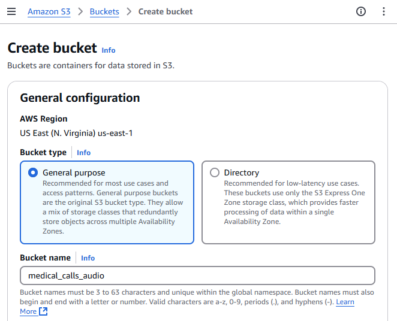

## Introduction

In part 1 of this series, we explored Amazon Bedrock and its capabilities for working with Large Language Models (LLMs). We covered how to set up an AWS account, create and configure IAM users with appropriate security policies, and request access to specific models in Amazon Bedrock. We concluded by demonstrating how to use the Boto3 SDK to make API calls to these models and successfully generate responses from them. This foundational knowledge will now help us as we move forward with our medical call analysis system.

Patient calls contain vital information that requires transcription and summarization. We'll start by uploading a call segment to Amazon S3 storage. Amazon Transcribe will then automatically convert the speech to text, creating a readable transcript of the conversation. In this article, we'll set up a transcription service that monitors an S3 bucket for new audio files and creates JSON transcripts.

We will create an automated workflow using AWS Lambda to monitor S3 events. When someone uploads a new audio file to our S3 bucket, it triggers our Lambda function, which then initiates a transcription job using Amazon Transcribe. This serverless architecture makes our transcription process fully automated and scalable, while remaining cost-effective since we only pay for the processing time we use.

## Create an Amazon S3 Bucket

We first need to create a storage bucket. Begin by logging into the AWS Management Console and navigate to the S3 service, either by searching for "S3" in the service search bar or selecting it from the "Storage" section. Once there, click on the "Create bucket" button. This will prompt you to provide details for the new bucket. Start by entering a unique name for your bucket in the "Bucket name" field and then select the Region in which you want your bucket to be located. The other settings can be left at their default values for now. After that, scroll down and click on the "Create bucket" button. Now your bucket is ready for use, and you can proceed to upload your files.




## Amazon Transcribe Permissions

To allow automatic transcription when new audio files are uploaded to our S3 bucket, we need to create an IAM role that gives Amazon Transcribe access to our audio files. This role requires the following permissions:

```json
{
  "Version": "2012-10-17",
  "Statement": [
    {
      "Effect": "Allow",
      "Action": ["s3:GetObject", "s3:PutObject"],
      "Resource": ["arn:aws:s3:::medical-calls-audio-bucket/*"]
    }
  ]
}
```

## Transcribe Lambda Function Code

We will implement an automated workflow using AWS Lambda that listens for S3 events. When a new audio file is uploaded to our S3 bucket, it triggers an event that activates our Lambda function. This function will then automatically initiate a transcription job using Amazon Transcribe.

The workflow will follow these steps:

1. A new audio file is uploaded to our designated S3 bucket
2. The upload triggers an S3 event notification
3. This event activates our Lambda function
4. The Lambda function calls Amazon Transcribe to start a new transcription job
5. Amazon Transcribe processes the audio and generates a JSON transcript
6. The transcript is saved back to our S3 bucket in a 'transcripts' folder

This serverless architecture ensures that our transcription process is fully automated, scalable, and cost-effective, as we only pay for the actual processing time used.

Let's create a Lambda function that triggers when a new audio file is uploaded to our S3 bucket. This function automatically starts an Amazon Transcribe job. Here's how it works: When S3 receives a new file, it sends an event to our function. The function extracts the bucket name and file name (key) from this event. After validating that the file is an MP3, it generates a unique job name using UUID and initiates the transcription. To do this, we first set up an Amazon Transcribe client by creating an instance of the service in the desired region. The transcription job includes specific parameters such as language code (en-US), media format (mp3), and speaker identification settings. The resulting transcript saves back to the same S3 bucket in a 'transcripts' folder. The function handles any errors by catching them and returning appropriate error messages. Upon successful execution, it provides a confirmation message that the transcription job was submitted.

```python
import boto3
import json
import uuid

def lambda_handler(event, context):
    bucket = event["Records"][0]["s3"]["bucket"]["name"]
    key = event["Records"][0]["s3"]["object"]["key"]

    print(f"Processing file {key} from bucket {bucket}.")

    # One of a few different checks to ensure we don't end up in a recursive loop.
    if not key.endswith(".mp3"):
        print("This demo only works with mp3 files.")
        return

    # Create a Boto3 client for the Transcribe service
    transcribe_client = boto3.client("transcribe", region_name="us-east-1")

    try:
        # Needs to be a unique name
        job_name = "transcription-job-" + str(uuid.uuid4())

        print(f"Starting transcription job {job_name}.")

        transcribe_client.start_transcription_job(
            TranscriptionJobName=job_name,
            Media={"MediaFileUri": f"s3://{bucket}/{key}"},
            MediaFormat="mp3",
            LanguageCode="en-US",
            OutputBucketName=bucket,
            OutputKey=f"transcripts/{job_name}.json",
            Settings={"ShowSpeakerLabels": True, "MaxSpeakerLabels": 2},
        )

        print(f"Transcription job {job_name} started successfully.")

    except Exception as e:
        print(f"Error occurred: {e}")
        return {"statusCode": 500, "body": json.dumps(f"Error occurred: {e}")}

    return {
        "statusCode": 200,
        "body": json.dumps(
            f"Submitted transcription job for {key} from bucket {bucket}."
        ),
    }
```

Let's examine each transcription job parameter and its purpose:

- `TranscriptionJobName`: The unique name of the transcription job.
- `Media`: A dictionary that specifies the location of the audio file to transcribe. It's formatted as an S3 URI, which is just the bucket name and file name combined.
- `MediaFormat`: The format of the audio file. In this case, it's an mp3 file.
- `LanguageCode`: The language of the audio file. Here, it's set to 'en-US' for US English.
- `OutputBucketName`: The name of the S3 bucket where the transcription results should be stored.
- `Settings`: A dictionary of settings for the transcription job. Here, it's set to show speaker labels with a maximum of 2 speakers.

## Creating a Lambda Function in the AWS Console

To create a Lambda function through the AWS Management Console, follow these steps:

1. Navigate to the AWS Lambda console by searching for "Lambda" in the AWS services search bar
2. Click the "Create function" button in the top right corner
3. Choose "Author from scratch" to start with a blank function
4. Provide these basic settings:
   - Function name - Choose a descriptive name
   - Runtime - Python 3.11
   - Architecture - Choose x86_64
   - Execution role - Create a new role or select an existing one
5. Click "Create function" to generate your Lambda function

In the code tab of your Lambda function, you'll find lambda_function.py. Delete any existing code and paste the transcription function code provided above. Save the changes by clicking "Deploy"


Before testing the function, we need to update the IAM role permissions to allow the Lambda function to use Amazon Transcribe services. Add the following permissions to your IAM role policy:

```json
{
  "Effect": "Allow",
  "Action": [
    "transcribe:StartTranscriptionJob",
    "transcribe:GetTranscriptionJob",
    "transcribe:ListTranscriptionJobs"
  ],
  "Resource": "*"
}
```

This allows the Lambda function to start transcription jobs, retrieve their status, and list existing jobs. Without these permissions, the function will fail when attempting to interact with Amazon Transcribe.

Test your function by clicking the "Test" button and creating a new test event with the sample S3 event JSON provided earlier

After deployment, ensure that:

- The function has the correct IAM role with permissions for S3 and Transcribe
- The function timeout is set appropriately (default is 3 seconds, which might not be enough)
- The function has enough memory allocated
- The S3 trigger is properly configured to invoke the function

## AWS VSCode Extension

AWS offers a powerful VSCode extension called AWS Toolkit that streamlines the development and testing of Lambda functions. With this extension, you can invoke Lambda functions locally, debug your code, and simulate various AWS service events right from your VSCode environment.

The AWS Toolkit for VSCode provides several key features for Lambda development:

- Local Lambda function invocation using sample events
- Step-through debugging of Lambda functions
- Direct deployment to AWS from VSCode
- AWS Explorer for managing Lambda functions and other AWS resources
- SAM (Serverless Application Model) template support

To test your Lambda function using the AWS Toolkit:

1. Install the AWS Toolkit extension from the VSCode marketplace
2. Configure your AWS credentials in VSCode
3. Open your Lambda function code
4. Right-click in the editor and select "AWS: Invoke Lambda Function Locally"
5. Choose or create a test event JSON file (like the example shown above)


This local testing capability significantly speeds up the development process by allowing you to iterate and debug your Lambda functions without deploying them to AWS each time.

The example JSON event provided above can be utilized in multiple ways during development and testing. You can use it for local testing with the AWS SAM CLI, creating test events in the Lambda console, or writing unit tests for your Lambda function. The event contains essential information like the S3 bucket name and the object key (path to the transcript file), and includes a JSON transcript file that your function needs to validate.

Here's an example JSON event that simulates an S3 trigger event for the Lambda function:

```python
{
  "Records": [
    {
      "eventVersion": "2.1",
      "eventSource": "aws:s3",
      "awsRegion": "us-east-1",
      "eventTime": "2024-04-26T12:00:00.000Z",
      "eventName": "ObjectCreated:Put",
      "s3": {
        "s3SchemaVersion": "1.0",
        "bucket": {
          "name": "medical-calls-audio-bucket",
          "arn": "arn:aws:s3:::medical-calls-audio-bucket"
        },
        "object": {
          "key": "audios/phone_call.mp3",
          "size": 1024,
          "eTag": "d41d8cd98f00b204e9800998ecf8427e"
        }
      }
    }
  ]
}
```

To test the Lambda function directly from VSCode using the AWS Toolkit extension:

1. Open the AWS extension sidebar in VSCode (AWS icon)
2. Navigate to the "Lambda" section under your configured AWS region
3. Find and right-click on your transcription Lambda function
4. Select "Invoke in the cloud" from the context menu
5. A new editor will open where you can paste the sample S3 event JSON shown above
6. Click "Remote Invoke" to run the function in the cloud


After invocation, you can check the execution results in the "AWS Toolkit" output panel. To verify the transcription job was created, you can:

- Check the CloudWatch logs for your function
- Go to the Amazon Transcribe console to see the running job
- Monitor your S3 bucket's "transcripts" folder for the output file

## Setting Up S3 Event Notifications

To automate the process, we'll set up S3 to trigger our Lambda function when new audio files are uploaded. The function will automatically start the transcription job.

To set up S3 event notifications through the AWS Management Console:

1. Navigate to your S3 bucket and select the "Properties" tab
2. Scroll down to find the "Event Notifications" section and click "Create event notification"
    
    
    
3. Configure the event settings:
   - Event name: Enter a descriptive name (e.g., "AudioFileUploadTrigger")
   - Prefix: Enter "audio/" to limit the trigger to files in the audio folder
   - Suffix: Enter ".mp3" to only trigger on MP3 files
   - Event types: Select "All object create events"
4. Under "Destination", select "Lambda function" and choose your transcription function from the dropdown
5. Click "Save changes" to create the event notification


With these settings, the Lambda function will only trigger when MP3 files are uploaded to the audios/ directory in your S3 bucket. This helps prevent unwanted function invocations and ensures proper resource organization.

Once you configure the S3 event notification to trigger your Lambda function, you’ll see the trigger listed in your Lambda function’s configuration. There’s no need to add it again in the Lambda console. This single step establishes the connection, and your workflow is ready to go.


## Upload an Audio File to the Bucket

To upload an audio file to your S3 bucket through the AWS Management Console, follow these steps:

1. Open the AWS Management Console and navigate to the S3 service
2. Click on your bucket name from the list of buckets
3. Click the "Upload" button at the top of the bucket contents list
4. Click "Add files" or drag and drop your audio file (in this case, phone_call.mp3) into the upload area
5. Review the default settings for the upload. For basic uploads, the default settings are usually sufficient
6. Click "Upload" to start the file transfer

Once the upload is complete, you'll see your audio file listed in the bucket contents. The S3 event notification we configured earlier will automatically trigger the Lambda function to start the transcription process.


## Function Output

This is a portion of the output resulting from the transcription job. It includes the job name, account ID, status, and the transcribed text from the audio. It also contains information about the speaker labels, which can be used to distinguish between different speakers in the conversation.

```json
{
  "jobName": "transcription-job-abc78294-bfb4-4f22-ad8a-d3b26d5329cd",
  "accountId": "400513684195",
  "status": "COMPLETED",
  "results": {
    "transcripts": [
      {
        "transcript": "Good morning, Dr Hayes's office. Tarn speaking..."
      }
    ],
    "speaker_labels": {
      "segments": [
        {
          "start_time": "0.689",
          "end_time": "3.74",
          "speaker_label": "spk_0",
          "items": [
            {
              "speaker_label": "spk_0",
              "start_time": "0.699",
              "end_time": "0.97"
            },
...
```

## Conclusions

In this article, we explored the setup of an AWS Lambda function for transcribing audio files using Amazon Transcribe. We learned how to configure the necessary AWS resources, including creating an S3 bucket for audio storage, setting up a Lambda function with the appropriate Python code, and configuring IAM permissions for Transcribe services. We also covered the AWS VSCode extension, which provides powerful development tools for Lambda functions, enabling local testing and debugging. Furthermore, we detailed the process of setting up S3 event notifications to automatically trigger the Lambda function when new audio files are uploaded, creating an automated transcription pipeline.

In the next article of this series, we'll explore how to leverage Amazon Bedrock to analyze and summarize the transcripts generated by our Lambda function. This will help us extract meaningful insights from the transcribed medical calls, demonstrating the power of combining multiple AWS services for advanced text analysis.

## Resources

- Github Repo: [https://github.com/pedropcamellon/medical-calls-analysis-aws](https://github.com/pedropcamellon/medical-calls-analysis-aws)
