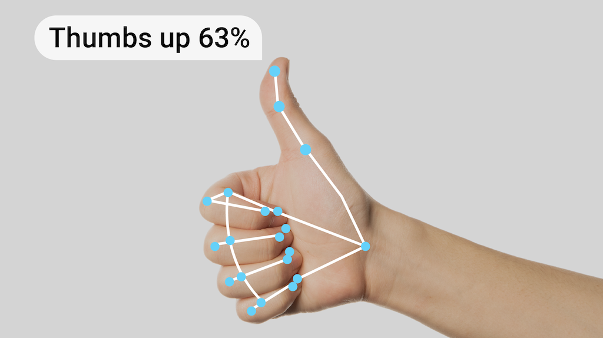
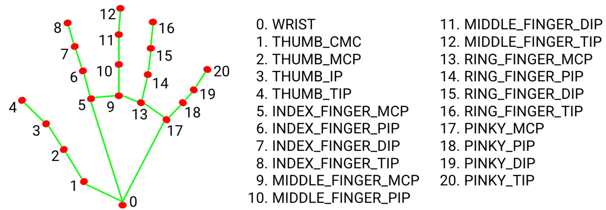

Live version: https://gesture-detection-analysis.streamlit.app/

Github Repo: https://github.com/pedropcamellon/gesture-detection-analysis

# Introduction

On-device AI is revolutionizing how we interact with technology by bringing powerful machine learning capabilities directly to our devices. This shift brings three key advantages: improved privacy, as data stays on your device and remains under user control; better performance, and offline functionality; and cost efficiency through eliminated cloud server costs and reduced bandwidth usage. This technological advancement is driving innovation across mobile devices, web browsers, and IoT systems. Thanks to developments like MediaPipe, Google's powerful open-source framework, and LiteRT, implementing on-device AI has become more accessible than ever, enabling applications from gesture recognition to real-time language processing while maintaining user privacy and reducing operational costs.

Gesture recognition represents a transformative frontier in Human-Computer Interaction (HCI), offering a more natural and intuitive way for users to communicate with digital systems. As we move beyond traditional input methods like keyboards and mice, gesture-based interfaces are becoming increasingly important in creating more accessible and user-friendly computing experiences. This project uses MediaPipe, Google's powerful open-source framework, to analyze gestures directly in your browser. When you upload a video, the system processes it locally using MediaPipe's gesture recognition model, ensuring your data never leaves your device. The model can detect and classify hand movements with high accuracy, all while maintaining complete privacy since no external API calls are made.

Using Python's MediaPipe SDK, I combined OpenCV for efficient image processing and frame manipulation with MediaPipe's powerful machine learning models to detect gestures. Everything is presented through an intuitive Streamlit web interface that makes the technology accessible to users.

OpenCV (Open Computer Vision) handles the fundamental image operations, including frame extraction, preprocessing, and basic computer vision tasks. Meanwhile, MediaPipe's pre-trained models process these prepared frames to detect hand landmarks and classify gestures in real-time. The Streamlit framework ties everything together, providing an accessible web interface that makes this sophisticated technology available to users without requiring deep technical expertise.



# **Technical Architecture Highlights**

The Streamlit web application provides an intuitive interface for video gesture analysis. When users upload a video file, it's temporarily stored and processed frame by frame. The application enforces a maximum duration limit to ensure smooth processing while providing real-time visual feedback through a progress bar and video preview.

```python
uploaded_file = st.file_uploader(
    "Choose a video file", type=["mp4", "avi", "mov"], help="Maximum file size: 50MB"
)
# ...
file_size = len(uploaded_file.getvalue())
        st.info(f"File size: {file_size / 1024 / 1024:.1f}MB")

        if file_size > MAX_VIDEO_SIZE:
            st.error("File too large!")
        else:
            if st.button("🎯 Analyze Gestures", type="primary"):
                with st.spinner("Processing video..."):
                    results = process_video(uploaded_file)
```

OpenCV handles the core video processing, extracting frames and converting them from BGR to RGB color format. To optimize performance, the system processes every fifth frame rather than analyzing each one. This approach maintains accuracy while significantly improving processing speed.

```python
def process_video(video_file):
    try:
        ...

        # Process video
        results = []
        cap = cv2.VideoCapture(video_path)
        total_frames = int(cap.get(cv2.CAP_PROP_FRAME_COUNT))
        fps = cap.get(cv2.CAP_PROP_FPS)
        duration = total_frames / fps

        ...

        recognizer = load_recognizer()

        frame_idx = 0
        while True:
            ...

            success, frame = cap.read()
            if not success:
                break

            # Process every 5th frame for efficiency
            if frame_idx % 5 == 0:
                # Convert BGR to RGB
                frame_rgb = cv2.cvtColor(frame, cv2.COLOR_BGR2RGB)
                mp_image = mp.Image(image_format=mp.ImageFormat.SRGB, data=frame_rgb)

                # Detect gestures with confidence threshold
                recognition_result = recognizer.recognize(mp_image)

		...

            frame_idx += 1

        return results

    except Exception as e:
        st.error(f"Error processing video: {str(e)}")
        return None
```

The MediaPipe gesture recognizer model then analyzes each processed frame, detecting hand gestures with high precision. The system only records gestures that exceed a 50% confidence threshold, ensuring reliable results. For each detected gesture, the application captures the timestamp, gesture name, and confidence score.

```python
def process_video(video_file):
  ...

  if (
      recognition_result.gestures
      and recognition_result.gestures[0][0].category_name != "None"
  ):
      gesture = recognition_result.gestures[0][0]
      if (
          gesture.score > 0.5
      ):  # Only include gestures with >50% confidence
          timestamp = frame_idx / fps
          results.append(
              {
                  "time": f"{timestamp:.1f}s",
                  "gesture": gesture.category_name,
                  "confidence": f"{gesture.score:.2f}",
              }
          )
	...
```

Throughout the analysis, users can monitor progress through the live video preview and progress bar. They also have the option to stop the analysis at any time, with the system preserving any detected gestures up to that point. Once complete, the results are displayed in a clear, organized format that allows users to review the temporal sequence of detected gestures.

```python
def process_video(video_file):
  ...

  # Update progress and preview
  progress = min(float(frame_idx) / total_frames, 1.0)
  progress_bar.progress(progress)
  frame_placeholder.image(frame, channels="BGR", use_container_width=True)
	...
```

# MediaPipe Gesture Recognizer Model

MediaPipe's Gesture Recognizer employs a two-part model architecture for efficient hand gesture detection: a hand landmark detector and a gesture classifier.

The hand landmark detector identifies 21 key points on each hand. It uses a streamlined ML pipeline to process both images and video streams in real-time, outputting hand coordinates and orientation (left/right). The model was trained on 30K real-world images plus synthetic data for robust performance. The model processes input images at either 192x192 or 224x224 resolution and uses float16 quantization for efficient memory usage while maintaining high accuracy. The model is customizable through Model Maker, allowing developers to extend its capabilities for specific use cases.



The gesture classification system consists of a lightweight model that processes hand landmarks to identify gestures. It outputs probabilities across 8 classes, including one "unknown" class and seven predefined gestures. The system is highly efficient, using smart tracking to follow hand positions between frames rather than performing full detection each time. It only runs complete hand detection when tracking fails. The model can be customized through training to recognize additional gestures beyond its built-in capabilities, and when both custom and standard classifiers detect a gesture, the system prioritizes the custom classification.

The Gesture classification model bundle can recognize these common hand gestures:

| **Index** | **Gesture Name**     | **Label**   |
| --------- | -------------------- | ----------- |
| 0         | Unrecognized gesture | Unknown     |
| 1         | Closed fist          | Closed_Fist |
| 2         | Open palm            | Open_Palm   |
| 3         | Pointing up          | Pointing_Up |
| 4         | Thumbs down          | Thumb_Down  |
| 5         | Thumbs up            | Thumb_Up    |
| 6         | Victory              | Victory     |
| 7         | Love                 | ILoveYou    |

If the model detects hands but does not recognize a gesture, the gesture recognizer returns a result of "None". If the model does not detect hands, the gesture recognizer returns empty.

# Local Setup and Usage

Setting up the project locally is straightforward. While the complete and most up-to-date installation instructions can be found in the project's [README](https://github.com/pedropcamellon/gesture-detection-analysis/blob/main/README.md), here's an overview of the process.

First, clone the repository to your local machine using Git and navigate to the project directory. Then, install the project dependencies using the UV package manager.

```bash
git clone https://github.com/pedropcamellon/gesture-detection-analysis.git
cd gesture-detection-analysis
uv sync
```

The next crucial step is downloading the MediaPipe gesture recognition model, which provides the core functionality for gesture detection.

```bash
powershell -Command "Invoke-WebRequest -Uri https://storage.googleapis.com/mediapipe-models/gesture_recognizer/gesture_recognizer/float16/1/gesture_recognizer.task -OutFile models/gesture_recognizer.task"
```

Once everything is set up, you can launch the application using Streamlit. The web interface will open in your default browser, where you can upload videos for gesture analysis. The system processes your videos and presents the results in a clear table format, showing the timestamp of each detected gesture, the type of gesture recognized, and the model's confidence level in its detection.

```bash
streamlit run src/app.py
```

Once running, simply upload a video, click "Run Analysis", and the app will process the video, displaying a results table with:

- **Timestamp:** When the gesture was detected.
- **Gesture:** The recognized gesture name.

# Live Demo

Try out the live demo here: https://gesture-detection-analysis.streamlit.app/

# Conclusions

This project demonstrates several key insights about modern gesture recognition technology. First, the ability to process gestures locally, without cloud dependencies, marks a significant advancement in privacy-preserving AI applications. Second, the combination of MediaPipe's powerful ML models with OpenCV's robust image processing capabilities shows how different tools can be integrated effectively for real-time analysis. Finally, the project highlights how frameworks like Streamlit can make complex AI technologies accessible to end users through intuitive interfaces. As gesture recognition continues to evolve, this approach of prioritizing privacy, performance, and accessibility will become increasingly valuable for developing human-computer interaction systems.

# Sources

1. https://ai.google.dev/edge/mediapipe/solutions/vision/gesture_recognizer
2. https://ai.google.dev/edge/mediapipe/solutions/vision/gesture_recognizer/python
3. https://storage.googleapis.com/mediapipe-assets/gesture_recognizer/model_card_hand_gesture_classification_with_faireness_2022.pdf
