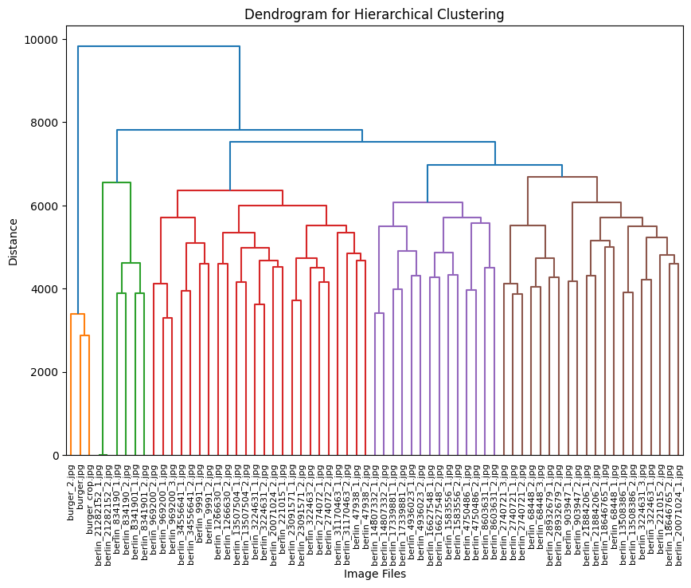
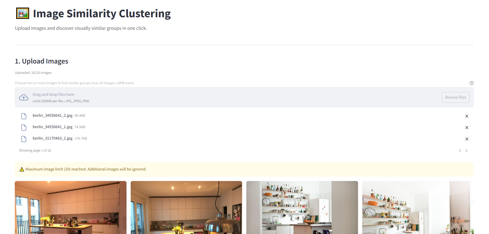
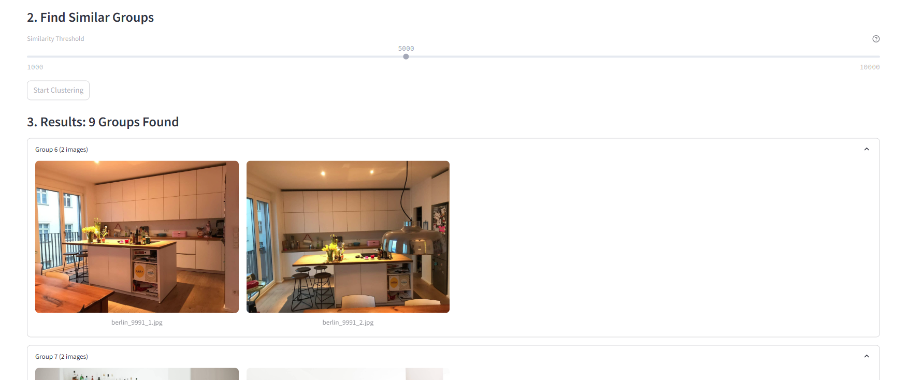

Live version: https://image-similarity-clustering-engine.streamlit.app/

Github Repo: https://github.com/pedropcamellon/image-similarity-clustering-engine

## Introduction

Privacy concerns about cloud storage are growing, with 75% of users worried about photo leaks. This has led many to look for alternatives to cloud-based photo processing. Cloud APIs, while common for image processing, have clear drawbacks. They require internet connectivity and expose your photos to potential security risks through external server transmission. This solution processes everything on your device using MediaPipe. You get advanced photo organization without sending anything to the cloud. Your photos stay on your device, giving you full control. This local-first approach puts privacy first. Here's how it works and why it matters for managing your photos.

## Computer Vision Meets Unsupervised Learning

At the heart of our zero-cloud clustering solution lies a sophisticated interplay between computer vision and unsupervised learning algorithms. Our system uses MediaPipe's MobileNet V3 architecture to create image embeddings - numerical representations that capture the essence of each image. These embeddings work like digital fingerprints, converting visual information such as shapes, colors, textures, and patterns into a 1024-dimensional vector of numbers. This mathematical representation allows computers to measure similarity between images by comparing their embedding vectors. For example, two photos of dogs would have similar embedding patterns, while a photo of a dog and a car would have very different patterns. This powerful yet efficient process runs completely on your device using TensorFlow Lite optimization, processing each image in less than a millisecond on modern CPUs, ensuring both speed and privacy.

```bash
import mediapipe as mp
from mediapipe.tasks import python
from mediapipe.tasks.python import vision

# Create options for Image Embedder
model_file = "models/mobilenet_v3_small.tflite"
base_options = python.BaseOptions(model_asset_path=model_file)
l2_normalize = True  # @param {type:"boolean"}
quantize = True  # @param {type:"boolean"}
options = vision.ImageEmbedderOptions(
    base_options=base_options, l2_normalize=l2_normalize, quantize=quantize
)

# Create Image Embedder
with vision.ImageEmbedder.create_from_options(options) as embedder:
    # Format images for MediaPipe
    mp_images = [
        {"file_name": name, "mp_image": mp.Image.create_from_file(f"demo_data/{name}")}
        for name in IMAGE_FILENAMES
    ]

    # Embed images
    embedding_results = [
        {
            "file_name": mp_image["file_name"],
            "embeddings": embedder.embed(mp_image["mp_image"]),
        }
        for mp_image in mp_images
    ]

    # Print embeddings
    for result in embedding_results:
        print(f"File name: {result['file_name']}")
        print(f"Embeddings: {result['embeddings']}")
```

## How Image Similarity Really Works

Our image comparison system leverages cosine similarity to measure the similarity between MediaPipe-generated embeddings. Since MediaPipe normalizes these 1024-dimensional vectors during the embedding process (setting their magnitudes to 1), cosine similarity becomes particularly elegant - it effectively captures the angular relationships between vectors while being naturally magnitude-agnostic. This means we don't compare pixels directly, but rather focus on the directional relationships between these normalized mathematical representations, making the comparison particularly effective for high-dimensional feature spaces. The similarity is calculated using a straightforward formula that measures the cosine of the angle between two vectors:

```latex
similarity = cos(θ) = (A·B)/(||A||·||B||)
```

- **Range**: -1 (opposite) to 1 (identical)
- **Practical range**: 0-1 for images (0 = unrelated, 1 = duplicates)

In our implementation, we leverage MediaPipe's built-in cosine similarity calculation:

```python
similarity = vision.ImageEmbedder.cosine_similarity(
    embedding_results[i]["embeddings"].embeddings[0],
    embedding_results[j]["embeddings"].embeddings[0],
)
```

While cosine similarity is a powerful tool for comparing image embeddings, it comes with several important limitations. First, since it only considers the angle between vectors and not their magnitudes, images with vastly different intensities might be grouped together if they share similar patterns. The method also heavily relies on the quality of embeddings generated by the underlying neural network (MobileNet V3 in our case), making its effectiveness dependent on the model's ability to capture meaningful features. Additionally, cosine similarity assumes linear relationships between features and doesn't directly account for spatial relationships within images. This means that two images might be considered similar even if their spatial arrangements differ significantly. Despite these constraints, cosine similarity remains highly effective for comparing high-dimensional embeddings, offering computational efficiency and relative insensitivity to feature scaling.

## Understanding K-Means Clustering Implementation

K-means clustering serves as one of our primary methods for organizing similar images. The process begins by converting image embeddings into a numpy array for efficient computation. Using the Elbow Method, we determine the optimal number of clusters by analyzing distortion values across different cluster counts. The algorithm then follows an iterative process: it starts by randomly placing k centroids in the embedding space, assigns each image to its nearest centroid, updates centroid positions based on the mean of assigned points, and continues this cycle until reaching convergence or hitting the maximum iteration limit.

The K-means implementation has several key strengths worth highlighting. By converting image data to numpy arrays, we achieve rapid matrix operations for efficient processing. The algorithm removes uncertainty in cluster selection through automated optimization via the Elbow Method. Additionally, its iterative approach, involving multiple refinement passes, ensures the most optimal grouping of similar images.

The K-means clustering algorithm offers several key advantages and limitations. On the positive side, it is straightforward to implement and understand, provides excellent computational efficiency when dealing with large datasets, and creates clusters of consistent size. However, it also comes with notable drawbacks: it requires users to specify the number of clusters beforehand, shows sensitivity to the initial placement of centroids, and struggles to effectively handle clusters with irregular shapes. It also may sometimes create artificial groupings to meet the specified number of clusters. These characteristics make it important to carefully consider whether K-means is the right choice for a specific image clustering application.

Here's the core implementation:

```python
import numpy as np
import cv2

# Convert embeddings to numpy array
embedding_vectors = np.array([
    result["embeddings"].embeddings[0] for result in embedding_results
])

# Perform K-Means clustering
k = optimal_clusters  # Determined by Elbow Method
criteria = (cv2.TERM_CRITERIA_EPS + cv2.TERM_CRITERIA_MAX_ITER, 100, 0.2)
_, labels, centers = cv2.kmeans(
    embedding_vectors.astype(np.float32),
    k,
    None,
    criteria,
    10,
    cv2.KMEANS_RANDOM_CENTERS
)

# Group images by cluster
clusters = {i: [] for i in range(k)}
for idx, label in enumerate(labels.flatten()):
    clusters[label].append(image_files[idx])
```

## Alternative to K-means: HDBSCAN Density-Based Clustering

HDBSCAN (Hierarchical Density-Based Spatial Clustering of Applications with Noise) represents a more sophisticated approach to image clustering that addresses many limitations of traditional methods. Unlike K-means, HDBSCAN doesn't require specifying the number of clusters beforehand and can identify clusters of varying densities and shapes.

The algorithm operates through several key steps:

1. **Transform the space:** First, it converts the distance between points into a sparse weighted graph
2. **Build the minimum spanning tree:** Constructs a tree that connects all points while minimizing the total distance
3. **Create a hierarchy of connected components:** Generates a dendrogram showing how points merge into clusters
4. **Extract the stable clusters:** Identifies the most persistent clusters across different density thresholds

```python
import hdbscan
import numpy as np

# Initialize HDBSCAN clusterer
clusterer = hdbscan.HDBSCAN(
    min_cluster_size=3,  # Minimum size for a cluster
    min_samples=1,       # How conservative clustering should be
    metric='euclidean'   # Distance metric
)

# Fit and predict clusters
cluster_labels = clusterer.fit_predict(embedding_vectors)

# Organize images by cluster
clusters = {}
for idx, label in enumerate(cluster_labels):
    if label not in clusters:
        clusters[label] = []
    clusters[label].append(image_files[idx])

```

The dendrogram visualization serves as a powerful tool for understanding hierarchical relationships in our image clusters. By displaying the distance between clusters on the vertical axis and individual images or clusters on the horizontal axis, it reveals the structure of our dataset. The height of each branch visually represents the degree of difference between clusters, while horizontal cuts across the dendrogram reveal different levels of clustering granularity. This hierarchical representation enables us to explore natural groupings within our image dataset at multiple similarity levels, offering deeper insights than what traditional flat clustering methods can provide.



## Small Demo Web App using Streamlit

I created a simple demo using Streamlit to test the application features in a web browser. The server component is flexible and can run anywhere you choose - locally, on a remote machine, or in the cloud. The code structure also makes it easy to adapt the functionality into a standalone desktop application if desired:



A simple slider interface controls HDBSCAN's clustering threshold, allowing users to fine-tune how aggressively images are grouped. The "Start Clustering" button triggers the analysis process, providing a clear action point for users. This minimalist interface makes sophisticated machine learning accessible while still offering granular control over the clustering behavior.



A key optimization to ensure smooth performance is using a **Caching Strategy**. Using Streamlit's @st.cache_data decorator for embedding results allows us to avoid redundant computations when users adjust clustering parameters or revisit previously processed images. This caching mechanism significantly improves the app's responsiveness by storing computed embeddings in memory, eliminating the need to re-process images that have already been analyzed.

The cache is particularly effective during interactive clustering sessions where users might experiment with different parameters, as shown in the code above. When the same image is encountered again, Streamlit automatically retrieves the cached embeddings instead of computing them anew, resulting in near-instantaneous updates to the clustering visualization.

```python
@st.cache_data
def get_embeddings(images, model_path="models/mobilenet_v3_small.tflite"):
    base_options = python.BaseOptions(model_asset_path=model_path)
    options = vision.ImageEmbedderOptions(
        base_options=base_options, l2_normalize=True, quantize=True
    )

    with vision.ImageEmbedder.create_from_options(options) as embedder:
        embedding_results = []
        for img_name, img in images.items():
            mp_image = mp.Image(image_format=mp.ImageFormat.SRGB, data=img)
            embedding = embedder.embed(mp_image)
            embedding_results.append({"file_name": img_name, "embeddings": embedding})
    return embedding_results
```

## Future Improvements and Opportunities

Looking ahead, there are several exciting opportunities to enhance this project further. On the technical front, we could significantly improve the system's capabilities by integrating more sophisticated embedding models such as EfficientNet or Vision Transformers, while maintaining our commitment to local processing.

The clustering approach itself could be refined by implementing hybrid methods that combine the strengths of different algorithms. For instance, we could use K-means for initial grouping, followed by HDBSCAN for refinement, potentially leading to more accurate and meaningful clusters. Performance improvements through GPU acceleration and parallel processing could also enable the system to handle much larger image collections efficiently.

We could implement additional privacy-preserving techniques, such as image preprocessing to remove sensitive metadata, further strengthening our commitment to user privacy. These enhancements would significantly expand the utility and scope of the application while maintaining its fundamental promise of privacy-first, local processing.

## Conclusions

This project successfully demonstrates that sophisticated image clustering can be performed entirely on local machines without cloud APIs. By combining lightweight models like MobileNet V3 with robust clustering algorithms (HDBSCAN and K-means), and optimizing performance through strategic caching of embedding computations, we've created an efficient local solution. The implementation leverages cosine similarity as an effective metric for comparing high-dimensional image embeddings, while exploring the complementary strengths of different clustering approaches - notably HDBSCAN's superior flexibility compared to K-means for real-world scenarios. Most importantly, this implementation proves that modern edge devices can handle complex machine learning workflows while preserving user privacy and reducing dependency on external services.

## Sources

1. https://ai.google.dev/edge/mediapipe/solutions/vision/image_embedder/python#image
