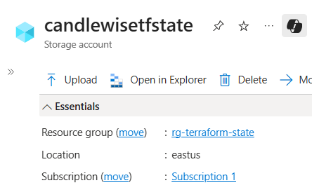
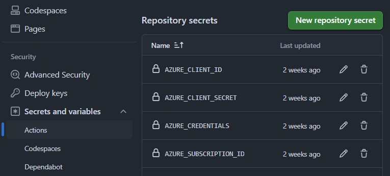
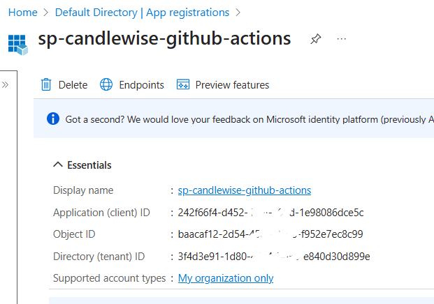
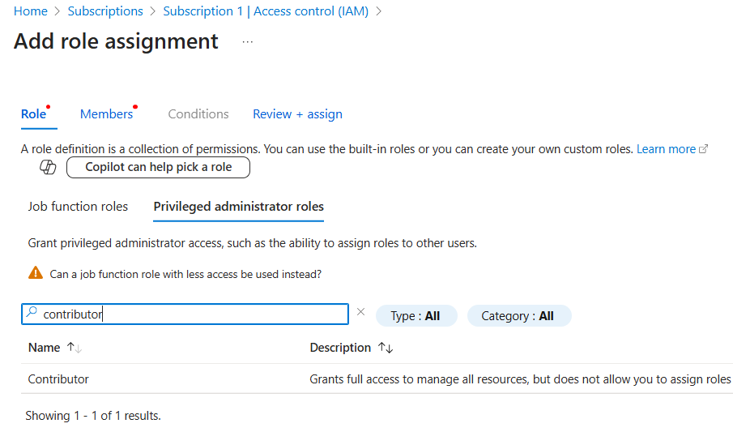
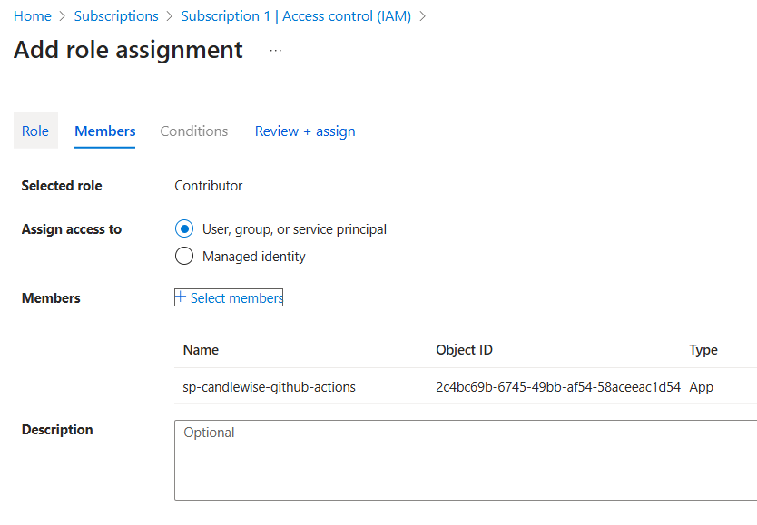
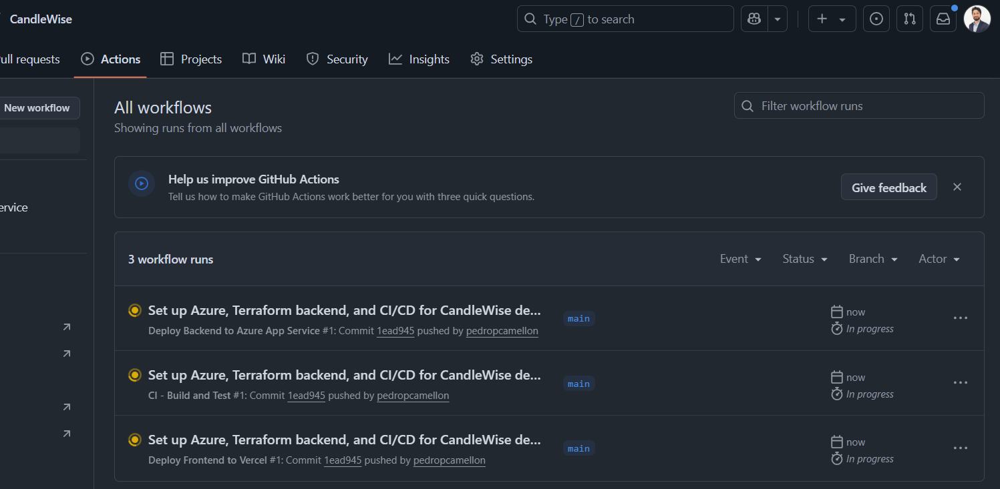

## Introduction

In my previous article, I successfully deployed the CandleWise portfolio management application to Azure using manual configuration steps. Building on this foundation, I'm now advancing my implementation by creating a modern full-stack application with a Next.js frontend and .NET Core backend in a unified monorepo structure.

In this article, I'll demonstrate how I automated my entire infrastructure using Terraform scripts specifically designed for Azure resources. I'll then explain how I implemented a comprehensive CI/CD pipeline with GitHub Actions that handles my complete deployment strategy - automatically deploying the Next.js frontend to Vercel and the .NET Core backend to Azure App Service. This approach ensures consistent, version-controlled deployments while significantly reducing manual configuration and potential human error.

## Frontend Setup with Next.js

For the frontend development of CandleWise, I created a modern React application using Next.js 15 with TypeScript. I started by establishing a monorepo structure with a dedicated frontend directory, implementing Next.js with TypeScript and Tailwind CSS for styling. The responsive UI featured portfolio dashboard components, all powered by properly configured environment variables for API connections.

The heart of CandleWise is its portfolio dashboard that tracks stock holdings in real-time. I implemented interactive stock cards showing price details with directional indicators (↗↘) that visually communicate price movements. One of my favorite features is the line charts displaying price history with time filtering options, allowing users to analyze stock performance over different periods. I also added an auto-refresh toggle, giving users control over when to fetch new data, and optimized performance through efficient state management with React hooks.

The architecture I designed includes a dedicated services layer for API interactions, Next.js API routes serving as proxies to the backend endpoints, shared TypeScript interfaces between frontend and backend, and React hooks implementing a source-of-truth pattern for clean data flow. A particularly engaging feature is the dynamic portfolio visualization using Recharts, which updates every 10 seconds for actively viewed stocks.

Building CandleWise wasn't without challenges. Managing real-time data updates without overwhelming the API or causing performance issues required implementing a batch price fetching system that gets all portfolio stock prices in a single API call, along with configurable refresh intervals and proper cleanup mechanisms.

I faced an infinite API call loop due to reactivity issues where portfolio state updates triggered continuous API calls. The solution involved implementing useCallback with proper dependencies and using functional state updates to prevent re-render cycles. Next.js API route conflicts emerged when the rewrites() function in next.config.js intercepted all /api/\* requests, which I fixed by refining the routing configurations.

Security was another concern – I initially had API keys hardcoded in controllers, creating a vulnerability. I addressed this by implementing proper dependency injection with an AlpacaMarketDataService and secure configuration management.

The architecture evolved significantly during development. I moved from hardcoded demo data to a proper API layer fetching real stock prices from Alpaca Markets. The data flow became cleaner and more unidirectional, with the backend serving as the single source of truth for portfolio data, while the frontend handles real-time updates and visualization. I simplified API responses by removing wrapper objects, making the frontend code more intuitive.

I established clear boundaries between data fetching, state management, and UI rendering, improving maintainability and testability. The backend became the definitive data source, with Next.js acting as a proxy layer. Batch endpoints for fetching multiple stock prices in a single call reduced network overhead and improved performance.

## Backend Refactoring

I built the CandleWise backend using [ASP.NET](http://ASP.NET) Core 8, focusing on creating a robust foundation for our portfolio management application. Starting with a standard Controllers pattern, I integrated with Alpaca Markets API to provide real-time stock data while maintaining a simplified data model for portfolio management.

As development progressed, I made several critical architectural improvements. One of the first implementing proper dependency injection patterns. API keys use a secure configuration-based approach and created a dedicated AlpacaMarketDataService to handle all external API interactions. This not only improved security but also made the codebase more maintainable and testable.

For better API design, I simplified response structures by removing unnecessary wrapper objects with data/success fields, creating a cleaner and more intuitive API for frontend consumption. One of the most impactful performance enhancements was implementing a batch price endpoint that accepts multiple stock symbols in a single request, significantly reducing API calls and improving frontend responsiveness.

I also portfolio allocation calculations on the backend ensured a single source of truth for critical financial calculations. Throughout the backend, I implemented comprehensive error handling with proper HTTP status codes and standardized response formats, making debugging and frontend integration more straightforward.

Security was a primary concern, so I implemented proper configuration management for API keys and set up CORS configurations for controlled frontend access. The architecture now follows clean separation of concerns with distinct layers for controllers, services, and data access.

To better support the frontend, I added several specialized features. I implemented company name mapping directly in the stock price endpoint, eliminating the need for additional frontend lookups. The dynamic allocation calculations on the backend ensure consistent portfolio visualization across all client devices. By structuring API responses to minimize payload size while providing all necessary data for UI rendering, I was able to optimize network traffic without sacrificing functionality.

I also restructured the portfolio data model to clearly separate static data (holdings) from dynamic data (prices), which proved essential for efficient real-time updates. This required deep understanding of both [ASP.NET](http://ASP.NET) Core and Next.js architecture patterns to ensure seamless integration between the layers.

These backend improvements resulted in a much more responsive application with cleaner data flow between layers. Through this process, I learned that thoughtful backend architecture is critical for frontend success - by moving complex calculations server-side and designing intuitive APIs, I created a more maintainable and performant application overall.

## CI/CD - Terraform

As a solo developer on the CandleWise project, I leveraged Terraform as an invaluable DevOps tool that significantly streamlined my infrastructure management process. Its declarative approach to infrastructure as code proved extremely beneficial, allowing me to define, provision, and version control my cloud resources with confidence. I managed the Terraform state remotely in Azure using a storage account, which provided a secure, centralized location for state files while enabling proper locking mechanisms to prevent concurrent operations.



For this specific project, Terraform helped me efficiently deploy and manage the backend resources in Azure, including the App Service for hosting the [ASP.NET](http://ASP.NET) Core API, Application Insights for monitoring, and the necessary networking components. The ability to define infrastructure through code aligned perfectly with my goal of creating a repeatable, consistent deployment process across different environments.

Throughout this journey, I found the learning experience particularly valuable. Working with Terraform reinforced core DevOps principles like immutability, idempotence, and infrastructure versioning—skills that have proven transferable across various cloud platforms and projects. The lessons learned from implementing Terraform in this solo project have significantly enhanced my DevOps capabilities and will continue to influence my approach to infrastructure management.

## CI/CD - Github Actions

This project gave me an excellent opportunity to explore GitHub Actions, a powerful DevOps tool I hadn't used before. I implemented a comprehensive CI/CD pipeline for CandleWise that automated both frontend and backend deployments while maintaining infrastructure through code.

### Backend Workflow

For the backend, I created a GitHub Actions workflow that automatically deploys our [ASP.NET](http://ASP.NET) Core application to Azure App Service whenever changes are pushed to the main branch. The workflow is configured to trigger only when changes are made to backend code, infrastructure files, or the workflow itself:

```yaml
name: Deploy Backend to Azure App Service
on:
  push:
    branches: [main]
    paths:
      - "backend/**"
      - "infra/**"
      - ".github/workflows/deploy-backend.yml"
  pull_request:
    branches: [main]
    paths:
      - "backend/**"
      - "infra/**"
```

The deployment process integrates with Terraform, which runs after a pull request is approved. This allows me to manage all Azure infrastructure as code, ensuring consistency across environments and enabling version control for infrastructure changes. My workflow applies Terraform configurations to provision necessary Azure resources before deploying the application code.

To support this workflow, I organized the repository with a clear structure, including a .github/workflows directory for GitHub Actions configurations, dedicated directories for Terraform files, and environment-specific configuration files. This organization not only keeps the repository clean but also makes the CI/CD processes easy to understand and maintain.

The most significant benefit of this implementation has been the elimination of manual deployment steps, which has streamlined the development process and reduced the potential for human error. Each change now goes through a consistent deployment pipeline, ensuring that the application is always deployed in a predictable manner.

Environment variables are securely stored using GitHub Secrets, eliminating the need to hardcode sensitive information in the repository.



The backend API is hosted on Azure App Service (F1 free tier for this project), while the frontend application is hosted on Vercel with automated deployments.

In my journey to set up CI/CD for CandleWise, I learned how to integrate GitHub Actions with Azure for automated deployments. One of the most critical parts of this process was creating and configuring a service principal in Azure. A service principal is essentially an identity created for use with applications, hosted services, and automated tools to access Azure resources. It's required because you need a secure way for your GitHub Actions workflows to authenticate with Azure without using your personal credentials.

I created the service principal using the default settings. After registration, I created a client secret by going to Certificates & secrets, adding a new client secret with a 12-month expiration, and immediately copying the value since it's only shown once. This secret acts as the password for the service principal.



With the service principal created, I needed to grant it proper permissions. I assigned it the Contributor role at the subscription level by going to my subscription, selecting Access control (IAM), adding a role assignment, and selecting Contributor. This role gives the service principal permission to manage all resources in the subscription without being able to grant access to others, which is perfect for CI/CD pipelines.





After setting up the service principal, I gathered the required values: clientId (Application ID), clientSecret (the value I copied), subscriptionId, and tenantId (Directory ID). I formatted these into a JSON object and added it as the AZURE_CREDENTIALS secret in my GitHub repository. This secret allows GitHub Actions to authenticate with Azure during deployment.

In my GitHub Actions workflow, I used the azure/login@v2 action with my AZURE_CREDENTIALS secret to authenticate with Azure. For Terraform operations, I set up environment variables (ARM_CLIENT_ID, ARM_CLIENT_SECRET, ARM_TENANT_ID, ARM_SUBSCRIPTION_ID) from these same values to enable Terraform to authenticate with Azure without using the Azure CLI.

The separation of concerns was important - I used the azure/login action for deploying to Azure App Service, while Terraform operations used environment variables for authentication. I learned that Terraform expects these credentials in a specific format, and mixing authentication methods can lead to errors.

Understanding and implementing service principals was a crucial step in automating my deployment process. It provided a secure way for GitHub Actions to interact with Azure resources without exposing my personal credentials, while maintaining the principle of least privilege by only granting necessary permissions.

### Frontend Workflow

For the frontend deployment workflow, the CI/CD pipeline integrates seamlessly with Vercel. The workflow is triggered on pushes to the main branch and pull requests, ensuring consistent validation of code changes.

For the frontend deployment, I created a Vercel project and connected it to my GitHub repository. This integration allowed me to leverage Vercel's specialized hosting environment for Next.js applications while maintaining control over the deployment process through GitHub Actions. After connecting the repository, I configured project settings in the Vercel dashboard, including environment variables needed for API communication and other application settings.

One critical aspect of this implementation is that I've disabled Vercel's automated builds to prevent conflicts with our GitHub Actions workflow. This ensures that deployments only happen through our controlled CI/CD process, maintaining consistency between testing and production environments.

The frontend deployment pipeline includes several key steps:

- Linting and type checking using ESLint and TypeScript
- Building the Next.js application with production optimizations
- Deploying to Vercel using their CLI with environment-specific configurations

The Vercel deployment leverages environment-specific tokens and project IDs stored as GitHub secrets, ensuring secure deployment without exposing sensitive credentials. The workflow also includes a verification step that checks if the deployed frontend can successfully connect to the backend API.



## Conclusions

Implementing CI/CD for CandleWise provided me with valuable industry-relevant skills. I mastered creating path-specific workflows that trigger deployments only when relevant files change. This precision creates efficient pipelines that deploy only affected components, saving resources and reducing deployment times.

Practicing how to programmatically declare cloud resources with Terraform gave me a highly transferable skill. Managing remote state and implementing consistent deployment patterns across environments is crucial in enterprise settings.

Configuring Azure service principals and implementing proper secret management with GitHub Secrets taught me industry best practices for secure automation. Creating seamless workflows between GitHub Actions, Azure, and Vercel showed me how to coordinate deployments across different hosting platforms—a critical skill in today's diverse cloud ecosystems.

The most valuable skill I gained was implementing full automation from code commit to production deployment. This end-to-end pipeline integrates infrastructure provisioning with application deployment, significantly improving reliability and development speed.

This CI/CD implementation marks a significant milestone in my development journey. By eliminating manual steps and creating consistent deployment patterns, I've built a foundation that lets me focus on feature development rather than operational concerns. These automation skills apply directly to enterprise environments where reliable, repeatable deployments are essential.
