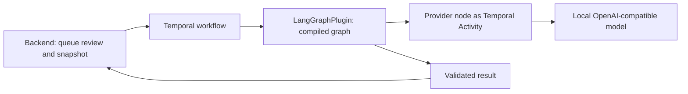

I built Folium's first chart-review agent with LangGraph inside Temporal. LangGraph owns the agent graph and any loop logic; Temporal provides the durable runtime around it: workflow state, retries, execution history, and a clear terminal result. This first attempt is deliberately small, but it establishes the boundary for richer agent behavior later.

The feature is deliberately bounded. It is clinician-requested draft support over synthetic data, not diagnosis, treatment advice, or autonomous action. It reviews an immutable snapshot of one active interaction rather than searching a whole chart.

That product boundary also kept the technical design honest. I did not need an autonomous loop for v1, but I did need an agent runtime that could grow into one without rebuilding the orchestration layer.

## The split that mattered

LangGraph is the right place for agent behavior: graph state, nodes, routing, and the loop that decides whether more work is needed. In Folium, the graph owns prompt construction, the local provider call, and strict output validation.

Temporal solves a different problem. It runs the workflow durably, records its history, retries failed Activities according to policy, and gives the backend native status and result reads. The backend creates the queued review, starts one workflow with a serialized snapshot, and persists either a completed validated draft or an explicit failure.

The worker registers the compiled graph through Temporal's `LangGraphPlugin`. The graph's model-facing work is executed through a Temporal Activity, giving that network/model call Temporal-managed timeouts and retries. That is the key detail: agent logic stays in the graph without baking workflow concerns into every node.

## Why the integration is useful

Putting a graph directly behind an API endpoint would make the simple path easy, but it leaves the operational work scattered: retry rules, state recovery, status tracking, and failure handling. Putting all agent logic into orchestration code has the opposite problem: the graph becomes harder to evolve.

The native integration gives each layer a clean job. LangGraph expresses what the agent does. Temporal makes sure that work has a durable lifecycle. The UI can show queued, processing, completed, or failed states from the persisted review record, and it never has to infer progress from partial model output.

There is a useful constraint here: data crossing a Temporal Activity boundary is serialized. The worker rehydrates the chart-review input with Pydantic validation before graph nodes access it. It is a small implementation detail, but it prevents an easy mistake: assuming an in-memory model survives a durable workflow boundary unchanged.

## A foundation, not an endpoint

The completed flow calls a locally hosted `mediphi-clinical` model through an OpenAI-compatible API, validates the structured response and citations, and persists a clearly labelled draft with its workflow outcome. A malformed response becomes an explicit error state rather than a partial result.

This is the foundation for what comes next: approved tool calls, offline evaluations that gate agent behavior, and, where the workflow earns the complexity, multiple specialized agents. LangGraph can model those decisions and handoffs. Temporal can make their execution observable, durable, and recoverable.

More capable retrieval and agent loops still need approved source blocks and explicit budgets. This first attempt establishes the runtime boundary before expanding the agent's reach.

The practical lessons were less glamorous than the diagram: durable workflows serialize data, so worker inputs must be revalidated; container dependencies need explicit service URLs rather than localhost defaults; and internal citation identities should remain internal. The clinician sees stable, readable source references, while the worker validates against canonical snapshot IDs. Those boundaries made the workflow safer to operate and easier to debug.

Explore the implementation in [Folium on GitHub](https://github.com/pedropcamellon/folium).

## Demo

  <iframe
    src="https://www.youtube-nocookie.com/embed/isl5LUkjc3w"
    title="Folium chart-review demo"
    style="position: absolute; inset: 0; width: 100%; height: 100%; border: 0;"
    allow="accelerometer; autoplay; clipboard-write; encrypted-media; gyroscope; picture-in-picture; web-share"
    allowfullscreen
  ></iframe>

  <iframe
    src="https://www.youtube-nocookie.com/embed/QfX_-l5aRUc"
    title="Folium chart-review implementation walkthrough"
    style="position: absolute; inset: 0; width: 100%; height: 100%; border: 0;"
    allow="accelerometer; autoplay; clipboard-write; encrypted-media; gyroscope; picture-in-picture; web-share"
    allowfullscreen
  ></iframe>

